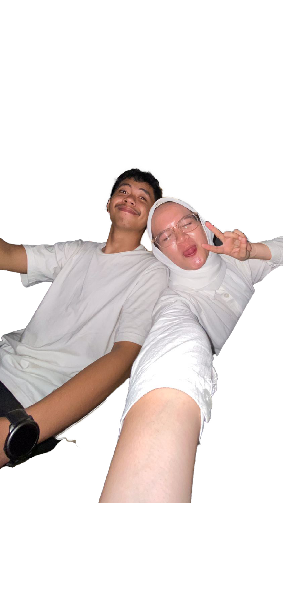

Dibuat Oleh PT. Inspirasi Cemerlang Indonesia 
( Andi Irfan Maualana )
All Rights reserved
<html lang="en">
<head>
    <meta charset="UTF-8">
    <meta name="viewport" content="width=device-width, initial-scale=1.0">
    <title>Happy Birthday, Ex!</title>
    <link rel="stylesheet" href="https://cdnjs.cloudflare.com/ajax/libs/font-awesome/6.0.0-beta3/css/all.min.css">
    
</head>
<body>
    <!-- Flower Animation -->
    

    

    

    

    

    

    

    

    <!-- Background Music -->
    <audio id="background-music" loop>
        <source src="selamatulangtahun.mp3" type="audio/mp3">
        Your browser does not support the audio element.
    </audio>

    

        
Halo Ex Hehehe!

        
Kasih masukki namata biar bisaki lanjut:

        <input type="text" id="userName" placeholder="*Nama Lengkap" style="padding: 10px; font-size: 1.2em; border-radius: 5px; border: 1px solid #ddd; width: calc(100% - 24px); box-sizing: border-box;">
        <button class="start-btn" onclick="startExperience()">Start</button>
    

    

        

            
Untukmu yang Berbahagia, !

            

                Hari ini adalah hari yang sangat spesial, karena ini adalah hari lahirmu. Aku bersyukur atas setiap detik yang pernah kita lewati bersama. Kamu adalah anugrah yang pernah hadir dalam hidupku.
            

            
❤️

            

                
            

            
With all my hopes, Andi Irfan Maulana

            <button class="next-btn" onclick="nextSlide(1)">Next</button>
        

        

            
Kenangan Manis

            

                Di hari ini, mari kita kembali mengingat semua kenangan manis yang pernah kita lalui. Terima kasih telah menjadi bagian dari hidupku, walaupun sekarang kita mungkin sudah berbeda tujuan.
            

            
💖

            

                
            

            
Forever yours, Fatri Utami Zeizar

            <button class="next-btn" onclick="nextSlide(2)">Next</button>
        

        

            
Selalu Dihati

            

                Meskipun kita mungkin tidak lagi bersama, kamu akan selalu memiliki tempat di hatiku. Terima kasih telah memberi warna dalam hidupku.
                Dinonton nah video yang dibawah sampai selesai.
            

            
💞

            

                
            

            <button class="next-btn video-btn" onclick="showVideo()"> >>DINONTON SAMPAI SELESAI<< </button>
        

    

    

        

            <video controls>
                <source src="awaldanakhir.mp4" type="video/mp4">
                Your browser does not support the video tag.
            </video>
        

        <button class="next-btn" onclick="backToSlides()">Kembali</button>
        <button class="send-btn" onclick="sendGiftRequest()">Spesial Request</button>
    

    
</body>
</html>
